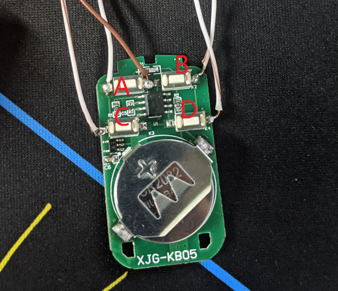
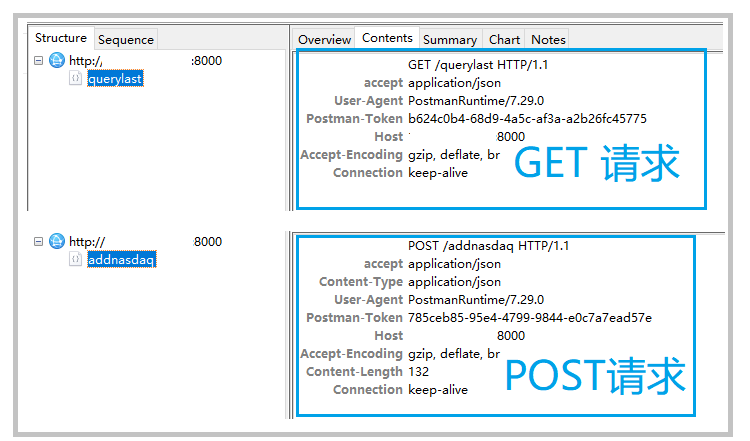

## ESP8266 Remote Control Electronic Door

### Introduction:

##### This is a small IoT project that uses the ESP8266 to network-control a relay, enabling remote control of an electronic door via mobile phone. It allows for opening and closing the door with a single tap.


Over three weekends, I learned the basics of using the ESP8266 and made a small toy.

It allows me to control the electronic door's opening and closing via my mobile phone, so I no longer have to worry about not having my keys and being locked out. (Facepalm)

Use Case: The electronic door supports an infrared remote control. Sometimes, if I forget the remote or access card, I have to call a colleague to open the door. Therefore, I wanted to put the remote control switch inside my mobile phone.

### Structure Diagram:

Right-click to save and view a larger image if you can't see it clearly.


### Hardware and Software Description:

Hardware: ESP8266 Mainboard controls relays, which connect to an infrared remote control.

Frontend: A Flutter demo (took half a day to build, the interface is too basic).

Backend: API uses FastAPI + Python, database: MySQL.

### Logic Description:

The main functions of the ESP8266 are in the `door.ino` file.

`setup()` mainly performs Wi-Fi connection initialization.

`loop()` function repeatedly requests the server, queries the latest command. If the command status is 1, it indicates that it needs to be executed. The command is executed, and after execution, the data status is updated to 0.

Command execution depends on the `ACTION_NAME` field. For example, if command A is executed, command A is executed. Command A corresponds to setting pin A low level, waiting 200 milliseconds, and then resetting it high level.

See the correspondence between commands ABCD and pins.

``` const uint8_t PORT_A = D1; // Corresponding pin

const uint8_t PORT_B = D2; //

const uint8_t PORT_C = D6; //
const uint8_t PORT_D = D7; //`

```

On the server side, three interfaces are built using FastAPI and deployed using Docker.

- addnasdaq: Creates a new command, called by the client, adding a new command.

- querylast: Queries the latest command, checks if the ESP8266 has a specified command to call.

- updatenasdaq: Updates the status of a specified command, called after the ESP8266 has finished executing the command.

The database uses MySQL; the database address and parameters are configured in the DbConfig.py file.

This concludes the introduction. If you want to try it out, refer to the following steps:

### Prerequisites:

To run this tutorial, some preparatory knowledge is required:

1. Understanding ESP8266 development environment setup, basic development and upload steps.

Parameters need to be modified, Wi-Fi information adjusted, and server address set up.

I recommend the basic tutorials from Taiji Makers; I completed the ESP part in two weekends by following the tutorials.

[IoT Basics Tutorial](http://www.taichi-maker.com/homepage/arduino-basic-tutorial-index/), [ESP8266 IoT Tutorial](http://www.taichi-maker.com/homepage/esp8266-nodemcu-iot/)

2. Understand Docker basics; refer to the tutorial to run examples.

Requires setting up the MySQL address and server address.

See the Docker tutorial on Bilibili (https://www.bilibili.com/video/BV1og4y1q7M4?spm_id_from=333.999.0.0)

[FastAPI Deployment Tutorial](https://blog.csdn.net/weixin_42493346/article/details/105854898)

3. Use Android Studio; you can run Flutter projects or download pre-packaged projects.

The project source code includes client-side source code. I've run it on Android, but haven't tested iOS. The code is very simple; you can modify it if you understand basic Dart syntax.

[Flutter Tutorial](https://book.flutterchina.club/chapter1/dart.html)

### How to Use

#### Materials Needed:

- Wireless remote control (supports learning and copying),

- ESP8266 motherboard

- 3.3V four-channel relay

- Power supply (using three 1.5V batteries instead)

- Tools: soldering iron, multimeter, solder wire, hot glue gun

- Server (already have one). If using a third-party service, please skip this step.

- Patience

##### Remote Control Modification

I'm using an ESP8266 to control the remote control, so modification is needed.

Use a soldering iron to solder the four leads at the ABCD switches on the remote control. These will be connected later. Relay

The negative ground connection is a universal connection, see diagram:



If connecting other controllers, please refer to a similar method; essentially, use a relay to short-circuit the original switch.

##### ESP8266 Environment Setup

The ESP8266 code is in the muc directory, `door.ino`

I referenced the Taichi Maker tutorial, "IoT Hardware Development for Beginners," which I studied for two weekends and highly recommend. Thank you!

Here's the link again: [ESP8266 Development Environment Setup Tutorial](http://www.taichi-maker.com/homepage/esp8266-nodemcu-iot/iot-c/nodemcu-arduino-ide/)

Prepare the environment and run the Blink code in the example. If it runs normally, the environment setup is successful.

After the demo runs on the ESP8266, you can import the `door.ino` file and modify the configuration.

Note the locations that need modification:

- WiFi username and password

`const char *ssid = "your_wifi_name"; // The name of the WiFi network to connect to`

`const char *password = "88888888"; // The password for the WiFi network to connect to`

- Server address and port

`const char *host = "101.xx.xxx.xxx";`

`const int httpPort = 8000;`

Supplement 1:

> This was my first time developing IoT hardware, and I was learning C++ on the fly. It was slow and not very standardized.

> Also, regarding the ESP8266's network library, I initially tried using the HTTPClient library, but it kept restarting after network requests. Research suggested it might be due to unstable voltage. After several unsuccessful attempts, I switched to the WiFiClient library.

> When writing the WiFiClient library, I needed to concatenate the header and body. The first time, I almost crashed because I couldn't figure out where a space or line break was missing. Then I came up with a solution:

First, I set up the server and tested it using the FastAPI test interface. I used Charles to capture packets; Charles clearly shows the header and body format, making concatenation easier.

>
> This might be due to my unfamiliarity with the technology. If there are better GET and POST solutions, please let me know.



Supplement 2

> During the development process, I initially used Arduino, which didn't support prompts or formatting. This was quite inconvenient for those familiar with IDEA shortcuts. Later, I configured a VS environment.

##### Connecting ESP8266 to Relay and Infrared Switch

Use breadcrumbs to connect the ESP8266 and infrared switch using the relay as shown in the diagram.

Note that the ESP8266 is powered via USB during development, outputting 3.3V to power the relay. When the relay receives a low level from the ESP8266, it short-circuits the two contacts, achieving the switch closure effect.

Connect the relay's negative terminal in parallel. Connect the four outputs to the four switches as shown in the diagram. Note that the connection is to the two normally closed terminals. If you're unsure which two are normally closed, use a multimeter to test.

Note: After the connection is established, you can use the door.ino code to test whether relay control is achieved. If the control is correct, then use network requests.

##### Server Deployment

The server-side code can be deployed directly to the server using Docker, or it can be deployed locally for LAN testing.

The server-side code directory is in the services directory.

Note the following modifications are needed:

MySQL address and port:

```
ipname = "101.xxx.xxx.xxx"
duankou = 3306
DB_NAME = "db_name"
userName = "userName"
pwd = "pwd"

```

Database initialization file: `nasdaq.sql`

FastAPI Local Deployment:

Import the project's services directory into PyCharm and run it directly.

FastAPI Server Deployment

``` [See Docker Deployment of FastAPI](https://blog.csdn.net/weixin_42493346/article/details/105854898)

##### Client Packaging

The client uses the Flutter solution. Currently, there's only one API request. I don't want to write code for either end (lazy -_-!!).

Configure the Flutter development environment in Android Studio. You can directly import it. For configuration tutorials, please refer to [Setting up a Flutter Development Environment](https://book.flutterchina.club/chapter1/install_flutter.html)

You need to modify the corresponding server address: `post('http://101.xxx.xxx.xxx:8000/addnasdaq',`


##### Testing:

1. First, test if the ESP8266 connects to WIFI normally.

2. Test if the ESP8266 can control the relay normally.

3. Deploy the server locally and use the Postman interface to test the database. 4. Check if the ESP8266 connection data is normal.

5. If the test is normal, the project is running normally.

Project Declaration: This project is a learning and practice project, for personal learning only.

I am new to IoT hardware, and there are bound to be some irregularities in the project. It is for learning purposes only. Contributions are welcome.

Currently Implemented Functions:

- [x] Supports remote control

- [x] Supports four-button control, expandable

- [x] Supports Android/iOS client implementation using Flutter, interface needs optimization

TODO:

- [ ] WiFi connection configuration

- [ ] Custom button configuration

- [ ] Interface optimization, currently the JSON is a bit large, needs optimization

- [ ] Automated deployment

- [ ] Tutorial optimization
